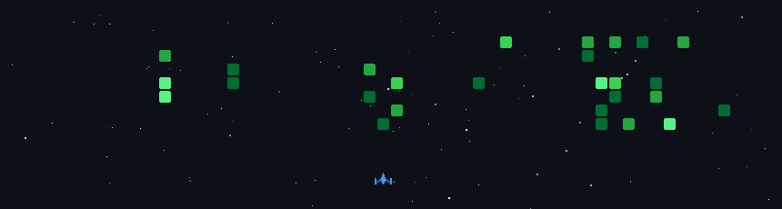

# Hi, I'm Oscar 👋

### Software Engineer | Systems & Backend Developer

---

### 🧠 About Me

* 💻 Working with: Systems programming & backend development
* 🌱 Currently exploring: Rust, Go, and scalable backend systems
* 🔍 Starting to contribute to open source
* 🚀 Goal: Build reliable and efficient systems

---

### 🧩 Tech Stack

  

---

### 🎮 GitHub Activity (Space Shooter 🚀)

  

---

### 📫 Connect with Me

* LinkedIn: [Oscar](https://www.linkedin.com/in/oscar-k-025252234/)

---

⭐️ Open to collaboration and open source contributions
